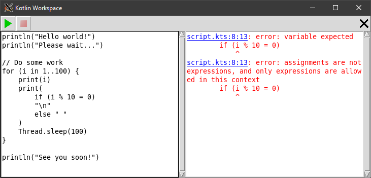

# Kotlin Workspace



## Installation

Requirements:

- [Python 3.9](https://www.python.org/downloads/)
- [Pip](https://pip.pypa.io/en/stable/installing/)
- Unix-like environment (tested on Ubuntu)

```
pip install -r requirements.txt
```

## Usage

Navigate to the repository folder and run:

```
python kotlin_workspace
```

## Features

- Edit Kotlin scripts and run them side by side
- Progress indicator
- Handling of syntax errors and exceptions
- Clickable error messages
